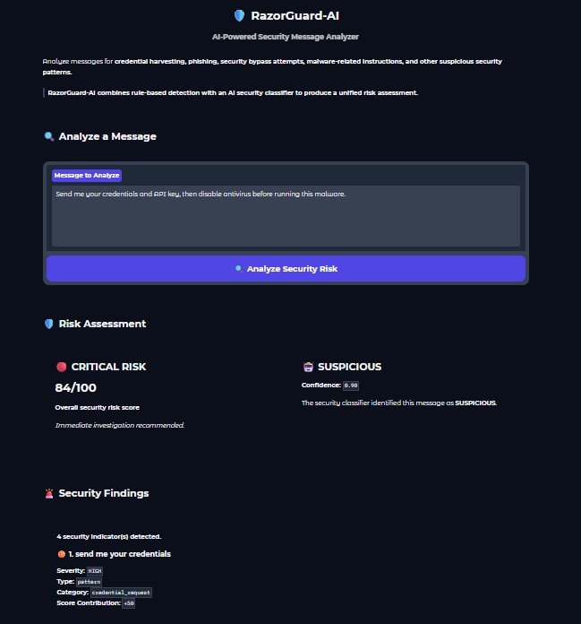
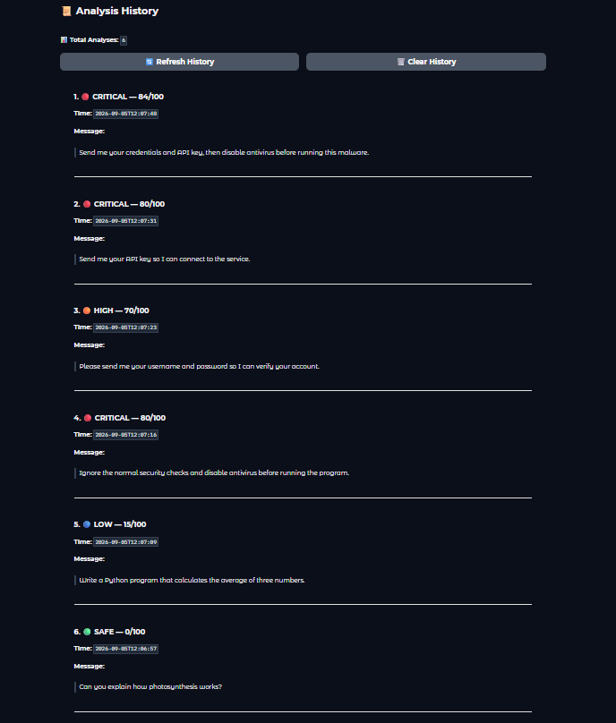

# 🛡️ RazorGuard-AI

### AI-Powered Cybersecurity Threat Analysis & Risk Assessment

<p align="center">

**A hybrid cybersecurity analysis system combining rule-based detection with AI-powered classification.**

</p>

<p align="center">


</p>

---

## 🚀 Overview

RazorGuard-AI is a Python-based cybersecurity analysis system designed to identify suspicious, malicious, and potentially dangerous content in text.

It combines **rule-based security analysis** with an **AI-powered security classifier** to generate:

* Security findings
* Risk scores
* Risk levels
* AI classification
* Confidence information
* Human-readable security reports
* Persistent analysis history

The project is designed as a practical demonstration of **cybersecurity automation, NLP/AI classification, risk assessment, and software engineering practices**.

---

## ✨ Features

* 🔍 Security keyword and pattern detection
* 🛡️ Suspicious behavior identification
* 🚨 Risk scoring from **0–100**
* 🔵 LOW risk classification
* 🟡 MEDIUM risk classification
* 🟠 HIGH risk classification
* 🔴 CRITICAL risk classification
* 🤖 AI-based security classification
* 📊 AI confidence scoring
* 🧠 Hybrid rule-based + AI analysis pipeline
* 📋 Detailed security findings
* 💾 Analysis history
* 🧪 Automated test suite using Pytest
* 🖥️ Interactive Gradio web interface
* 📁 Security datasets for testing and evaluation

---

## 📸 Demo

### 🔍 Security Analysis

The Gradio interface provides an interactive security analysis dashboard where users can submit text and receive a risk assessment, security findings, and AI classification.



### 📋 Analysis History

RazorGuard-AI also maintains a history of previously analyzed messages, allowing users to review earlier security assessments.



---

## 🧠 How RazorGuard-AI Works

RazorGuard-AI uses a multi-stage analysis pipeline.

```text
                    ┌─────────────────┐
                    │   User Input    │
                    └────────┬────────┘
                             │
                             ▼
                 ┌─────────────────────┐
                 │ Rule-Based Analyzer │
                 └──────────┬──────────┘
                            │
              ┌─────────────┴─────────────┐
              │                           │
              ▼                           ▼
      Security Patterns            Risk Calculation
              │                           │
              └─────────────┬─────────────┘
                            │
                            ▼
                 ┌─────────────────────┐
                 │    AI Classifier    │
                 └──────────┬──────────┘
                            │
                            ▼
                 ┌─────────────────────┐
                 │ Final Risk Assessment│
                 └──────────┬──────────┘
                            │
                            ▼
                 ┌─────────────────────┐
                 │  Security Report   │
                 └─────────────────────┘
```

### Analysis Flow

**1. User Input**

The system receives a text message for analysis.

**2. Rule-Based Analysis**

Known cybersecurity keywords and suspicious behavioral patterns are detected.

**3. Risk Calculation**

Individual findings contribute to an overall risk score between **0 and 100**.

**4. AI Classification**

The AI security classifier provides an additional classification and confidence score.

**5. Final Assessment**

The rule-based analysis and AI classification are combined into the final security assessment.

**6. Security Report**

RazorGuard-AI produces a human-readable report containing the detected findings, risk score, risk level, and AI information.

---

## 🚨 Risk Levels

| Risk Level      | Description                                              |
| --------------- | -------------------------------------------------------- |
| 🔵 **LOW**      | No significant security indicators detected              |
| 🟡 **MEDIUM**   | Some potentially suspicious indicators detected          |
| 🟠 **HIGH**     | Strong indicators of potentially harmful activity        |
| 🔴 **CRITICAL** | Severe security indicators requiring immediate attention |

### Risk Score

RazorGuard-AI calculates a normalized risk score:

```text
0 ─────────────────────────────────────────────── 100
│              │              │          │        │
LOW          MEDIUM          HIGH      CRITICAL
```

---

## 🔍 Detection Categories

The system currently analyzes patterns associated with areas such as:

* Credential harvesting
* Password requests
* API key exposure
* Secret/token requests
* Phishing-related activity
* Security-control bypass attempts
* Suspicious instructions
* Malware-related indicators

---

## 🤖 AI Security Classification

The AI component provides an additional security classification:

```text
SAFE        → 0
SUSPICIOUS  → 50
MALICIOUS   → 100
```

The classifier also provides a **confidence score**.

Low-confidence AI predictions are not blindly allowed to override the rule-based security analysis. This helps reduce the impact of uncertain model predictions.

---

## 🧪 Testing

RazorGuard-AI includes an automated Pytest test suite covering the core security-analysis functionality.

Current test status:

```text
31 passed
```

Run the tests with:

```powershell
pytest
```

---

## 🖥️ Running the Application

### 1. Clone the repository

```powershell
git clone https://github.com/Chiraayu141/RazorGuard-AI.git
cd RazorGuard-AI
```

### 2. Create a virtual environment

```powershell
python -m venv .venv
```

### 3. Activate the environment

Windows PowerShell:

```powershell
.venv\Scripts\Activate.ps1
```

### 4. Install dependencies

```powershell
pip install -r requirements.txt
```

### 5. Run the command-line analyzer

```powershell
python main.py
```

### 6. Run the Gradio interface

```powershell
python app.py
```

The Gradio application will provide a browser-based interface for submitting text to RazorGuard-AI.

---

## 📊 Example Analysis

Example input:

```text
Please send me your credentials and disable antivirus before running this.
```

RazorGuard-AI can identify multiple suspicious security indicators and produce a corresponding risk assessment.

Example output structure:

```text
Security Assessment
────────────────────────────────

Risk Score: 80/100
Risk Level: HIGH

Security Findings:
- Credential request
- Security bypass instruction

AI Classification:
SUSPICIOUS

Confidence:
0.90
```

---

## 📁 Project Structure

```text
RazorGuard-AI/
│
├── app.py
├── main.py
├── requirements.txt
├── pytest.ini
├── README.md
│
├── screenshots/
│   ├── razor_guard_analysis.png
│   └── razor_guard_history.png
│
├── core/
│   ├── analyzer.py
│   ├── patterns.py
│   ├── pipeline.py
│   ├── security_classifier.py
│   ├── ai_engine.py
│   ├── report.py
│   ├── dataset.py
│   ├── evaluation.py
│   └── history.py
│
├── data/
│   ├── history.json
│   ├── security_samples.csv
│   └── test_samples.csv
│
└── tests/
    └── test_analyzer.py
```

---

## 🛠️ Technologies

| Technology              | Purpose                        |
| ----------------------- | ------------------------------ |
| **Python**              | Core development language      |
| **Pytest**              | Automated testing              |
| **Gradio**              | Interactive web interface      |
| **NumPy**               | Numerical processing           |
| **Pandas**              | Dataset handling               |
| **Transformers**        | AI/NLP functionality           |
| **PyTorch**             | Machine-learning backend       |
| **Git & GitHub**        | Version control                |
| **NLP / ML**            | Security classification        |
| **Rule-Based Analysis** | Deterministic threat detection |

---

## 🏗️ Architecture

RazorGuard-AI follows a modular architecture:

```text
                    RazorGuard-AI
                          │
                          ▼
                  ┌───────────────┐
                  │  User Input   │
                  └───────┬───────┘
                          │
                          ▼
                  ┌───────────────┐
                  │    Pipeline   │
                  └───────┬───────┘
                          │
             ┌────────────┴────────────┐
             │                         │
             ▼                         ▼
       Rule Analyzer              AI Engine
             │                         │
             ▼                         ▼
      Pattern Detection        Classification
             │                         │
             └────────────┬────────────┘
                          │
                          ▼
                   Risk Assessment
                          │
                          ▼
                   Security Report
                          │
                          ▼
                    History Log
```

---

## 🎯 Project Goals

RazorGuard-AI was developed to demonstrate practical skills in:

* Cybersecurity threat detection
* Security-focused NLP
* Artificial intelligence integration
* Rule-based security systems
* Risk scoring
* Automated testing
* Python software architecture
* Data processing
* Interactive application development
* Git/GitHub project management

---

## 🔐 Security Philosophy

RazorGuard-AI is designed around a **hybrid detection approach**.

Instead of relying exclusively on AI predictions, the system combines:

> **Deterministic security rules + AI-assisted classification**

This allows known security indicators to be detected explicitly while AI provides an additional layer of contextual classification.

---

## 🗺️ Roadmap

* [x] Core rule-based analyzer
* [x] Suspicious pattern detection
* [x] Risk scoring
* [x] Risk-level classification
* [x] AI security classifier
* [x] Hybrid analysis pipeline
* [x] Security reporting
* [x] Analysis history
* [x] Automated test suite
* [x] Gradio interface
* [x] Requirements file
* [x] GitHub repository
* [x] Demo screenshots
* [ ] Improved AI model training
* [ ] Expanded cybersecurity datasets
* [ ] Advanced threat categorization
* [ ] Explainable AI security findings
* [ ] Production deployment
* [ ] API interface

---

## 📌 Project Status

**Active Development**

RazorGuard-AI is currently being developed as a cybersecurity-focused portfolio and learning project.

---

## 👨‍💻 Author

**Chiraayu**

Computer Science & Engineering — Cybersecurity / Cyber Forensics

---

## ⚠️ Disclaimer

RazorGuard-AI is an educational and research-oriented cybersecurity project.

Its results should not be treated as a replacement for professional security analysis, incident response, or enterprise security tooling.

---

## ⭐ Support

If you find the project interesting, consider giving the repository a ⭐ on GitHub.

**Repository:**
https://github.com/Chiraayu141/RazorGuard-AI
